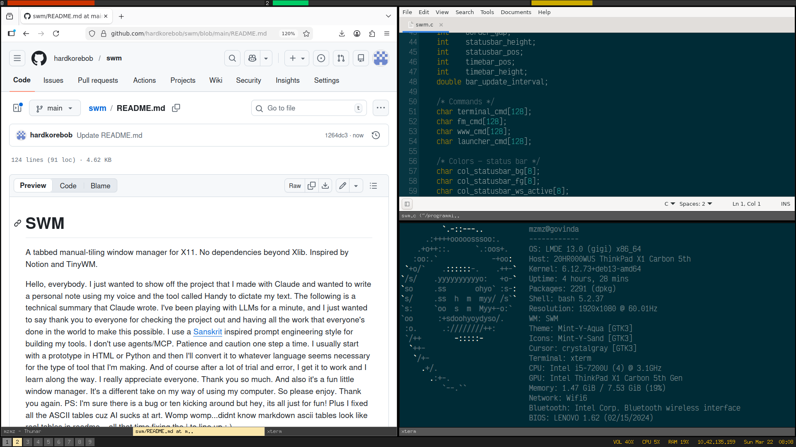

# SWM

A scriptable tabbed manual-tiling window manager for X11. No dependencies beyond Xlib. Inspired by Notion and TinyWM.



Hello, everybody. I just wanted to show off the project that I made and wanted to write a personal note. I just wanted to say thank you to everyone for checking the project out and having all the work that everyone's done in the world to make this possible. It's my personal little window manager. 

## Features

- Binary tree tiling with manual horizontal/vertical splits
- Tabbed windows within each tile
- 9 workspaces
- Status bar with workspace indicators, CPU, RAM, IP, Volume (mouse-wheel to adjust)
- Time bar with hex-time (block of 3m 45s * 16 = One hour; Blocks 0-F)
- EWMH fullscreen support
- Scriptable IPC via Unix domain socket (`swmctl`)
- Runtime config reload (SIGHUP or `swmctl reload`)
- Click-to-focus, click on tab bar to switch tabs
- Raise only using Mod4+Arrow (Amiga-style)

## Build & Install

Requires `libX11-dev` library & `-misc-fixed-medium-r-*-*-13-*-*-*-*-*-iso8859-1` bitmap font (pre-installed with X11...no worries). 

`chmod +x install.sh`

`./install.sh`

## IPC & swmctl

The real gold of this project is the scripting. You can make a script where the colors change at a certain interval giving the whole desktop a breathing-like, life-like quality. It can also make orchestrating custom layouts a breeze.

**Controllable at runtime via swmctl**

Every color in the entire UI, all geometry (tab bar height, border width, border gap, statusbar/timebar height and position), the update interval, all five program slots (terminal, browser, file manager, launcher, reload command), keybindings and set calls cfg_apply() immediately so it flushes the color cache, recalculates bar geometry, tears down and rebuilds the bars, repaints the root window background, re-arranges tiles, and re-grabs keys. So every change is live and instantaneous.

Commands: exec, split h/v, split-move h/v, unsplit, close, quit, reload, fullscreen, tab navigation (next/prev/move forward/backward), workspace switching (next/prev/by number), send to workspace, focus/move in four directions.

Query interface: current workspace number, window count in active tile, active window title, and tile count (layout). That's enough for a script to be state-aware.

Pipe mode: `echo "next-tab" | swmctl -`

**demo.sh**

It's a weird example of scripting a window manager to show the capabilities.

## Config

```
# SWM configuration
# Place at: ~/.config/swm/config
# Reload:   kill -HUP $(pidof swm)
#      or:  swmctl reload
#      or:  Mod4+r

# ===== Keys ======

bind = F1                  prev_tab
bind = F2                  next_tab
bind = F3                  prev_ws
bind = F4                  next_ws
bind = F6                  close
bind = F7                  spawn launcher
bind = F8                  spawn file_manager
bind = F9                  spawn browser
bind = F10                 spawn terminal
bind = Mod4+r              spawn reload
bind = Mod4+Return         spawn "xterm -e /bin/sh -c htop"
bind = Mod4+c              spawn "xed ~/config/swm/config"
bind = Mod4+h              split_h
bind = Mod4+v              split_v
bind = Mod4+d              remove_split
bind = Mod4+q              quit
bind = Mod4+comma          move_tab_bwd
bind = Mod4+period         move_tab_fwd
bind = Mod4+Left           focus left
bind = Mod4+Right          focus right
bind = Mod4+Up             focus up
bind = Mod4+Down           focus down
bind = Mod4+Shift+h        split_h_move
bind = Mod4+Shift+v        split_v_move
bind = Mod4+Shift+Left     move_win left
bind = Mod4+Shift+Right    move_win right
bind = Mod4+Shift+Up       move_win up
bind = Mod4+Shift+Down     move_win down
bind = Mod4+1              switch_ws 1
bind = Mod4+2              switch_ws 2
bind = Mod4+3              switch_ws 3
bind = Mod4+4              switch_ws 4
bind = Mod4+5              switch_ws 5
bind = Mod4+6              switch_ws 6
bind = Mod4+7              switch_ws 7
bind = Mod4+8              switch_ws 8
bind = Mod4+9              switch_ws 9
bind = Mod4+Shift+1        send_to_ws 1
bind = Mod4+Shift+2        send_to_ws 2
bind = Mod4+Shift+3        send_to_ws 3
bind = Mod4+Shift+4        send_to_ws 4
bind = Mod4+Shift+5        send_to_ws 5
bind = Mod4+Shift+6        send_to_ws 6
bind = Mod4+Shift+7        send_to_ws 7
bind = Mod4+Shift+8        send_to_ws 8
bind = Mod4+Shift+9        send_to_ws 9

# ===== Geometry =====
# 0 = bottom, 1 = top

tab_bar_height      = 18
border_width        = 1
border_gap          = 2
statusbar_pos       = 0        
statusbar_height    = 24
timebar_pos         = 1        
timebar_height      = 16
bar_update_interval = 1.0

# ===== Commands =====

terminal     = xterm
file_manager = thunar
browser      = firefox
launcher     = dmenu_run

# ===== Colours — status bar =====

col_statusbar_bg          = #1E1E1E
col_statusbar_fg          = #FFBF00
col_statusbar_ws_active   = #fbe7ac
col_statusbar_ws_inactive = #555555
col_statusbar_ws_occupied = #888888
col_statusbar_ws_fg_act   = #000000
col_statusbar_ws_fg_inact = #AAAAAA

# ===== Colours — tab bar =====

col_tab_active_bg     = #fbe7ac
col_tab_inactive_bg   = #3C3C3C
col_tab_active_fg     = #000000
col_tab_inactive_fg   = #AAAAAA
col_tab_bar_bg        = #2B2B2B
col_tab_active_bg_dim = #555555    
col_tab_active_fg_dim = #CCCCCC

# ===== Colours — borders / desktop =====

col_border_active   = #696969
col_border_inactive = #1E1E1E
col_desktop_bg      = #000000

# ===== Colours — hex-time bar =====

col_timebar_bg     = #1E1E1E
col_timebar_hour   = #CC3300
col_timebar_hex    = #00CC66
col_timebar_hseg   = #CCAA00
col_timebar_label  = #FFFFFF
col_timebar_track  = #333333
```
# SWM Design Patterns & Best Practices Catalog

A reference extracted from `swm.c` (~2860 lines, single-file C window manager) for use as prompting context when asking Claude AI how to produce robust systems software.

---

## 1. Single-File Architecture

The entire program lives in one `.c` file with no external dependencies beyond Xlib and libc. This is deliberate, not laziness.

**What it does:** Eliminates build complexity, header synchronization bugs, and link-order issues. The compile command is one line: `cc -O2 -o swm swm.c -lX11`.

**How swm organizes it:** The file is divided into labeled sections (`/* ===== Section Name ===== */`) that follow a strict dependency order:

```
Compile-time limits (#define)
  → Runtime config types (typedef Config, Keybind, Action)
    → Config parser functions
      → Data structures (Node, Workspace)
        → Globals
          → Utility functions (small, no X dependency)
            → X helpers (color, window ops)
              → UI components (bars, tabs, frames)
                → Actions (split, focus, spawn)
                  → IPC (socket command dispatch)
                    → Event handlers
                      → main()
```

**Prompt pattern:** "Write a single-file C program. Organize it with labeled sections in dependency order: types and constants first, then utility functions, then subsystem implementations, then the event loop, then main(). Use `/* ===== Section Name ===== */` comment banners to delimit sections. Forward-declare functions only when circular dependencies require it."

---

## 2. Tagged Union for Tree Nodes

The tiling layout is a binary tree where each node is either a leaf (tile with windows) or an interior node (split with two children).

```c
typedef enum { NODE_TILE, NODE_SPLIT } NodeType;

typedef struct Node {
    NodeType type;
    int x, y, w, h;          /* shared geometry */
    struct Node *parent;      /* shared upward link */
    union {
        struct { /* tile-specific fields */ } tile;
        struct { /* split-specific fields */ } split;
    };
} Node;
```

**Why it matters:** This is C's equivalent of a sum type / algebraic data type. The shared fields (geometry, parent pointer) sit outside the union so both variants can use them without casting. The variant-specific fields are in an anonymous union so access is `node->tile.nwindows` rather than `node->u.tile.nwindows`.

**The discipline:** Every function that touches a Node must check `node->type` before accessing variant fields. The compiler doesn't enforce this — it's a convention you maintain.

**Prompt pattern:** "Use tagged unions for any data structure that can be one of N distinct types. Place shared fields outside the union. Use an enum tag as the discriminator. Document which variant each field belongs to with comments."

---

## 3. Recursive Tree Operations with Flat Caching

The tree is walked recursively for operations like "collect all leaf tiles" or "recalculate geometry." But frequent callers use a cached flat array instead of re-walking every time.

```c
/* Walk tree → flat array (the slow path) */
static int collect_tiles(Node *node, Node **buf, int max);

/* Cached version — only rebuilds when dirty */
static int ws_get_tiles(Workspace *w, Node ***out) {
    if (w->tiles_dirty) {
        w->n_cached_tiles = collect_tiles(w->root, w->cached_tiles, MAX_TILES);
        w->tiles_dirty = 0;
    }
    *out = w->cached_tiles;
    return w->n_cached_tiles;
}
static void ws_invalidate_tiles(Workspace *w) { w->tiles_dirty = 1; }
```

**The pattern:** Recursive traversal for correctness + dirty-flag cache for performance. Mutations (split, unsplit) call `ws_invalidate_tiles()`. Readers call `ws_get_tiles()`, which rebuilds only when needed.

**Prompt pattern:** "When a recursive data structure is traversed frequently but mutated rarely, cache the traversal result with a dirty flag. Provide `invalidate()` and `get()` functions. Call `invalidate()` at every mutation site. Callers use `get()` and never call the raw traversal directly."

---

## 4. Ensure/Destroy Resource Lifecycle

X11 resources (windows, pixmaps) are managed with paired `ensure_*` / `destroy_*` functions:

```c
static void ensure_frame(Node *tile)  { /* create if None, else resize+recolor */ }
static void destroy_frame(Node *tile) { /* unmap, destroy, set to None */ }

static void ensure_tab_bar(Node *tile)  { /* same pattern */ }
static void destroy_tab_bar(Node *tile) { /* same pattern */ }
```

**What `ensure` does:** If the resource doesn't exist (`== None`), create it. If it does exist, update it to match current state (resize, recolor). This is idempotent — you can call it repeatedly without leaking.

**What `destroy` does:** If the resource exists, tear it down and set the handle to `None`. Also idempotent.

**Prompt pattern:** "For external resources (windows, file descriptors, GPU buffers), use paired ensure/destroy functions. `ensure()` creates-if-absent and updates-if-present. `destroy()` tears down and nulls the handle. Both must be idempotent. Call `ensure()` in the arrange/layout path, `destroy()` in the cleanup path."

---

## 5. Deferred Flag Coalescing

Multiple rapid mutations should not trigger expensive recalculations per mutation. SWM uses flags that accumulate intent and coalesce at the event loop boundary.

```c
static int apply_pending;                     /* set by each "set" command */
static volatile sig_atomic_t reload_pending;  /* set by SIGHUP or "reload" */
static int tiles_dirty;                       /* set by split/unsplit */

/* In the event loop, after processing all events: */
if (apply_pending) { apply_pending = 0; cfg_apply(); }
if (reload_pending) { reload_pending = 0; /* reload config */ }
```

**The pattern:** The handler sets a flag and returns immediately. The main loop checks all flags once per iteration. No matter how many `set` commands arrive in a single read batch (e.g., 23 color changes from a script), only one `cfg_apply()` fires.

**Prompt pattern:** "For operations triggered by external input that may arrive in bursts (config changes, resize events, network messages), use a deferred flag pattern. The handler sets a boolean. The main loop checks and clears it once per iteration. Document which flags exist and where they're checked."

---

## 6. Table-Driven Configuration

Config keys map to struct fields using a static table with `offsetof`:

```c
static const struct { const char *name; size_t off; } col_map[] = {
    { "col_statusbar_bg", offsetof(Config, col_statusbar_bg) },
    { "col_statusbar_fg", offsetof(Config, col_statusbar_fg) },
    /* ... 23 entries ... */
    { NULL, 0 }
};

/* Set: */ memcpy((char *)&cfg + col_map[i].off, val, 7);
/* Get: */ cmd_reply(fd, (const char *)&cfg + col_map[i].off);
```

**Why it matters:** Adding a new color is one table entry instead of adding an if-chain in `set`, `get`, and `defaults`. The table is reused by both the setter and getter — single source of truth.

**Prompt pattern:** "When a struct has many fields of the same type that are set/get by name, use a static table of `{ name, offsetof(Struct, field) }` pairs. Loop over the table for both reading and writing. Terminate with `{ NULL, 0 }`. This eliminates parallel if-chains and makes the config self-documenting."

---

## 7. IPC via UNIX Domain Socket with Line Protocol

The WM exposes a text-based command interface over a UNIX socket:

```
Socket: /tmp/swm.sock (or $XDG_RUNTIME_DIR/swm.sock)
Protocol: newline-delimited text, synchronous reply ("ok" or "err: reason")
Client tool: swmctl (10-line shell script wrapping socat)
```

**Design choices:**
- **Text, not binary.** Commands are human-readable, debuggable with `echo "query ws" | socat - UNIX-CONNECT:/tmp/swm.sock`.
- **Per-client buffering.** Each connected client has a `buf[512]` for incomplete reads. Newlines delimit commands.
- **Non-blocking, best-effort replies.** The WM never blocks on a slow client. `write()` return value is cast to void.
- **Pipe mode in client.** `swmctl -` reads stdin line by line, enabling `printf "set col_border_active #FF0000\nset col_desktop_bg #000000\n" | swmctl -` for batching.

**Prompt pattern:** "Implement IPC using a UNIX domain socket with a newline-delimited text protocol. Each command is a single line. Each reply is a single line ('ok' or 'err: <reason>'). Use non-blocking I/O and per-client read buffers. Provide a minimal shell-script client that wraps socat. Support a stdin pipe mode for batching."

---

## 8. Defaults → File → Runtime Overlay

Configuration is applied in layers:

```
cfg_defaults()    → hardcoded sane defaults for every field
cfg_load(path)    → overlay from ~/.config/swm/config (key=value)
"set" command     → runtime changes via socket
"reload" command  → re-runs defaults + load, preserving runtime socket
```

**The discipline:** `cfg_defaults()` sets every field to a known state. `cfg_load()` only overwrites what the file specifies. Runtime `set` changes individual keys. `reload` resets to defaults then re-applies the file, which means runtime-only changes are lost on reload — and that's intentional.

**Prompt pattern:** "Implement configuration as struct with three layers: hardcoded defaults (function that sets every field), file overlay (parser that overwrites only specified keys), and runtime changes (IPC set command). Provide reload that resets to defaults then re-applies the file. Document that runtime changes don't survive reload."

---

## 9. CLOEXEC Discipline for Spawned Processes

Every file descriptor that shouldn't leak to child processes is flagged:

```c
/* Listen socket created with CLOEXEC */
cmd_listen_fd = socket(AF_UNIX, SOCK_STREAM | SOCK_NONBLOCK | SOCK_CLOEXEC, 0);

/* Accepted clients get CLOEXEC after accept */
fcntl(cfd, F_SETFD, FD_CLOEXEC);

/* spawn() explicitly closes the X connection fd */
if (fork() == 0) {
    setsid();
    if (dpy) close(ConnectionNumber(dpy));
    execl("/bin/sh", "sh", "-c", cmd, (char *)NULL);
    _exit(1);
}
```

**Why all three are needed:**
- `SOCK_CLOEXEC` at creation = kernel auto-closes on exec.
- `FD_CLOEXEC` after accept = same for dynamically accepted fds.
- Explicit close of X fd = Xlib doesn't set CLOEXEC on its connection.

**Prompt pattern:** "When a long-running daemon spawns child processes, set CLOEXEC on every fd at creation time. For fds from libraries that don't set CLOEXEC (like Xlib), close them explicitly in the child after fork. Use `setsid()` in the child to detach from the parent's session."

---

## 10. Event Loop with Select-Based Multiplexing

The main loop handles three event sources through a single `select()`:

```c
while (running) {
    /* 1. Drain all queued X events (non-blocking) */
    while (XPending(dpy)) { XNextEvent(dpy, &ev); dispatch(ev); }

    /* 2. Periodic timer work */
    if (now - last_update >= interval) { bar_draw(); last_update = now; }

    /* 3. select() on X fd + command socket fds with timeout */
    FD_SET(x_fd, &fds);
    cmd_fdset(&fds);  /* adds listen_fd + all client fds */
    select(max_fd + 1, &fds, NULL, NULL, &tv);

    /* 4. Process command socket I/O */
    cmd_poll(&fds);

    /* 5. Handle deferred flags */
    if (apply_pending) { ... }
    if (reload_pending) { ... }
}
```

**The pattern:** Drain pending events first (they're already buffered), then check timers, then sleep until new input or timeout. This gives X events priority while still servicing the command socket and running periodic tasks.

**Prompt pattern:** "Implement the main loop as: (1) drain all pending events from the primary source, (2) run timer-based periodic work, (3) select/poll/epoll on all fd sources with a timeout derived from the next timer deadline, (4) process secondary I/O sources, (5) check and clear deferred flags. This ordering ensures the primary event source is never starved."

---

## 11. Persistent Shared Resources

Resources that are used on every draw call are allocated once and reused:

```c
static GC draw_gc;           /* created once in main(), used by all draw functions */
static XFontStruct *font;    /* loaded once, fid passed to XSetFont as needed */
```

Per-draw resources that can't be reused (Pixmaps that depend on window size) are still freed immediately:

```c
Pixmap pm = XCreatePixmap(...);
/* draw into pm */
XCopyArea(dpy, pm, target, draw_gc, ...);
XFreePixmap(dpy, pm);   /* freed, but draw_gc lives on */
```

**Prompt pattern:** "Allocate resources that don't change (GC, fonts, shared buffers) once at startup and reuse them. Only allocate per-frame resources (pixmaps, temp buffers) that truly depend on dynamic sizing. Always free per-frame resources in the same function that creates them."

---

## 12. Expensive Data Cached with Refresh Interval

Data that's costly to obtain (fork+exec, network syscall) is cached with a time-based refresh:

```c
#define BAR_INFO_INTERVAL 180.0   /* 3 minutes */
static int cached_volume;
static char cached_ip[64];
static double last_bar_info_update;

/* In bar_draw(): */
if (now - last_bar_info_update >= BAR_INFO_INTERVAL) {
    cached_volume = bar_read_volume();    /* popen("amixer") */
    bar_read_ip(cached_ip, sizeof(...));  /* UDP socket connect */
    last_bar_info_update = now;
}
/* Cheap data (CPU, RAM from /proc) is still read every call */
```

**Prompt pattern:** "When a draw/update function reads data of varying cost, separate cheap reads (file reads, memory access) from expensive reads (subprocess, network). Cache expensive results with a refresh interval. Document the interval and what triggers a refresh."

---

## 13. Dynamic Array with Geometric Growth

The tile window list grows on demand instead of using a fixed-size array:

```c
typedef struct {
    Window *windows;    /* heap-allocated */
    int nwindows;
    int win_cap;        /* allocated capacity */
} tile_fields;

static void tile_add(Node *t, Window w) {
    if (t->tile.nwindows >= t->tile.win_cap) {
        t->tile.win_cap = t->tile.win_cap ? t->tile.win_cap * 2 : 4;
        t->tile.windows = realloc(t->tile.windows,
                                  (size_t)t->tile.win_cap * sizeof(Window));
    }
    t->tile.windows[t->tile.nwindows++] = w;
}
```

**Why:** Split nodes no longer waste 512 bytes on an unused `Window[64]` array. Tiles start small (4 slots) and grow only when needed. Most tiles hold 1–3 windows; the rare case of 50 tabs still works.

**Prompt pattern:** "Use heap-allocated dynamic arrays with geometric doubling (start at 4, double on overflow) instead of fixed-size arrays in data structures. Store count and capacity alongside the pointer. Initialize with a small capacity and grow via realloc. Free in the destructor."

---

## 14. Heap-Allocated Variable-Length Strings

Fixed-size `char[32]` buffers for user-provided strings are replaced with `strdup`:

```c
char *sarg;   /* NULL or heap-allocated via strdup */

static void sarg_set(char **dst, const char *src) {
    free(*dst);
    *dst = (src && *src) ? strdup(src) : NULL;
}
```

**The discipline:** Every write goes through `sarg_set()`. Every read checks for NULL. Every reset path (config reload, bind clear) frees all allocated strings before zeroing counts.

**Prompt pattern:** "For user-provided strings of unpredictable length (commands, paths, labels), use heap-allocated `char *` with a setter function that frees the old value and strdup's the new one. Guard all reads against NULL. Free all strings in every reset/cleanup path."

---

## 15. Single Cleanup Path

There's exactly one place that tears down the program:

```c
static void action_quit(void) { running = 0; }

/* main(): */
while (running) { /* event loop */ }

/* Single cleanup path: */
cmd_cleanup();
bar_destroy();
bottom_bar_destroy();
cleanup_ewmh();
for (each workspace) { destroy tab bars and frames }
XFreeGC(dpy, draw_gc);
XCloseDisplay(dpy);
return 0;
```

**Why:** `action_quit()` doesn't do cleanup — it just sets the flag. The main loop exits naturally and hits one cleanup block. No risk of double-free, no duplicated teardown code, no `kill(getpid(), SIGTERM)` bypass.

**Prompt pattern:** "Never perform cleanup in action handlers. Set a flag to exit the main loop, and place all cleanup after the loop. This guarantees exactly one execution of teardown code regardless of which code path triggered shutdown."

---

## Using This Catalog in Prompts

When asking Claude to build software, reference these patterns by number:

> "Build a daemon that manages widgets. Use patterns #1 (single-file), #5 (deferred flags), #7 (UNIX socket IPC with line protocol), #10 (select-based event loop), and #15 (single cleanup path) from my reference catalog."

Or describe the architectural constraint directly:

> "The program should use a single event loop with select() that multiplexes the primary event source, a command socket, and timer-based periodic work. Expensive data like network lookups should be cached with a 3-minute refresh interval. All cleanup should happen in one block after the main loop, never in action handlers."

The patterns compose well. A typical systems daemon would use #1 + #5 + #7 + #8 + #9 + #10 + #15 as its skeleton, then add domain-specific patterns (#2, #3, #6, etc.) as the data model requires.
